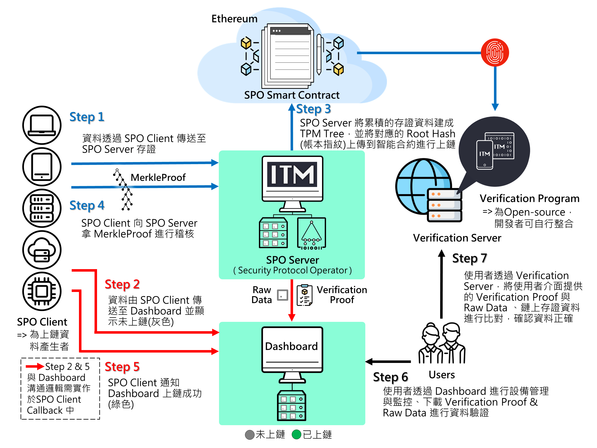

# ITM SPO SDK Sample 使用手冊

## Release Note

| Version | Project             | Note     |
| ------- | --------            | -------- | 
| 2.2.2   | SPO Server          | Verification Proof file extension change to `.itm`. |
|         | Spo Client          | Add IX Authentication to Cmd. |
|         | Verification Server | 1. Improvement of the result table UI. |
|         |                     | 2. The server now only shows the verify history from your local browser. Other users will not see your verify history anymore, increasing data privacy. |

## SPO Server 系統架構圖(含 Dashboard 公版)

## 架構元件說明

### SPO Client

1. 提供Client為Raw Data進行清算上鏈的功能：產生LedgerInput並傳送至SPO Server，並儲存SPO Server回傳的Receipt
2. 當SPO Server通知已上鏈的Clearance Order，會將對應的Receipt與智能合約上的Clearance Record進行驗證並產生驗證結果

### SPO Server

1. 接收SPO Client的LedgerInput並回傳Receipt
2. 累積LedgerInput到所設定可上鏈的量再進行清算上鏈，上鏈成功會通知SPO Client進行驗證
3. 根據Index Value Key與時間區間進行搜尋，產生VerificationProof，後續供 [Verification Program](https://github.com/itrustmachines/spo-verification-program) 進行驗證

### Dashboard
裝置資料公版，提供以下內容：
1. 顯示SPO Client提供的Raw Data
2. 顯示Raw Data的稽核狀態與Etherscan(以太坊瀏覽器)連結
3. 取得證據：使用者可在介面中，根據Index Value Key與時間區間進行搜尋，Dashboard會向SPO Server索取並產生VerificationProof

※ 若要成功將Raw Data顯示於公版Dashboard，存證之CMD須包含`deviceId`與`timestamp`兩欄位

### Verification Server

- 本服務提供給無整合 [Verification Program](https://github.com/itrustmachines/spo-verification-program) 的使用者的公開線上驗證服務，其包含：證據驗證(Proof Verification)、原始檔案驗證(Raw Data Verification)、還原公鑰及位址(Recovery Key and Address)
- Verification Server URL: https://verification.itrustmachines.com/

※ 若要能使用Verification Server的原始檔案驗證功能，存證之CMD須包含`fileName`與`fileHash`兩欄位

### [Verification Program](https://github.com/itrustmachines/spo-verification-program)

1. 驗證VerificationProof，並取得Error Report與Raw Data

## SDK 列表
欲申請以下列表測試開發請[聯絡我們](https://itrustmachines.com/)
- [itm-spo-sdk-java](https://github.com/itrustmachines/itm-spo-sdk-java)
- [itm-dashboard](https://github.com/itrustmachines/itm-dashboard)
- [itm-mcu-porting-kit](https://github.com/itrustmachines/itm-mcu-porting-kit)