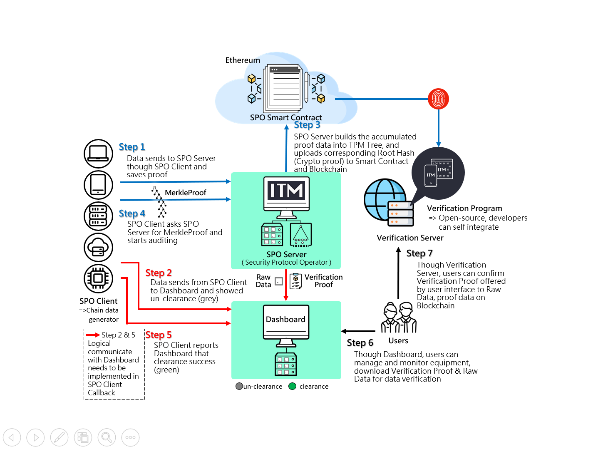

# ITM SPO SDK Sample User Guide

- [ITM SPO SDK Sample User Guide Traditional Chinese Version](./README_zh.md)

## Release Note

- [ITM SPO SDK Release Note](./doc/ReleaseNote.md)

## SPO Server System Architecture Diagram(include Dashboard public version)

## Architecture Component Description

### SPO Client

- Generates and sends LedgerInput to SPO Server and stores Receipt from SPO Server.
When SPO Server reports the chained Clearance Order:
1. the SPO client will verify receipt by the same clearance order. 
2. The SPO client will verify clearance record from Smart Contract. 
3. After both the receipt and clearance Record are checked, generate verify result.

### SPO Server

- Receives SPO Client LedgerInput and returns Receipt.
- Does clearance on LedgerInputs and upload them to Blockchain until it reaches the max amount or too much time passess. 
- SPO Client will verify when the success message is reported.
- Search based on Index Value Key and time interval, generates ITM proof token for the following verification by public [Verification Server](https://verification.itrustmachines.com/) or self-integrate [Verification Program](https://github.com/itrustmachines/spo-verification-program).

### Dashboard

Public version of Device data provides the following：

- Display Raw Data offered by SPO Server.
- Display audit status of Raw Data and Etherscan(Ethereum Blockchain Browser) link.
- Receive Proof：Users can search based on Index Value Key and time interval on interface. Dashboard will ask SPO Server for ITM proof token.

- If developers would like to show clearance records on ITM publish version of Dashboard, CMD must contain `deviceId` and `timestamp` fields.

### Verification Server

- Provide users who are not intergrating [Verification Program](https://github.com/itrustmachines/spo-verification-program) with a public online Verification Server, which include Proof Verification, Raw Data Verification, the Recovery Key and Attester wallet Address.
- Verification Server URL : https://verification.itrustmachines.com/

- If developers would like to use original file verification function in public [Verification Server](https://verification.itrustmachines.com/) provided by ITM, CMD must add `fileName` and `fileHash` fields.

### [Verification Program]

- Verify ITM proof token and receive Error Report and Raw Data.

## SDK List

To apply the follow list testing development, feel free to [Contact us](https://itrustmachines.com/).

- [itm-mcu-porting-kit](https://github.com/itrustmachines/itm-mcu-porting-kit) (Need GitHub authorization)
  - Provide Linux C or Azure Sphere SPO Client example code
  - master branches environment requirements：above Ubuntu 18.04 or Centos 7
  - azs-spo-c-client & azs-spo-c-client-single-thread branches environment requirements：
    - Azure Sphere SDK
    - Visual Studio or Visual Studio Code develop environment
    - Windows 10 operating system
- [itm-spo-sdk-java](https://github.com/itrustmachines/itm-spo-sdk-java) (Need GitHub authorization)
  - Provide Java environment SPO Client example code
  - Environment requirements：above Java 8, installed Maven
- [itm-spo-sdk-android](https://github.com/itrustmachines/itm-spo-sdk-android) (Need GitHub authorization)
  - Provide Andriod environment SPO Client example code
  - Environment requirements：
    - above Java 8, installed Maven
    - Android Studio develop environment
- [itm-dashboard](https://github.com/itrustmachines/itm-dashboard) (Need GitHub authorization)
  - Provide publish version of Dashboard example code
  - Environment requirements：above Java 11, installed Maven
