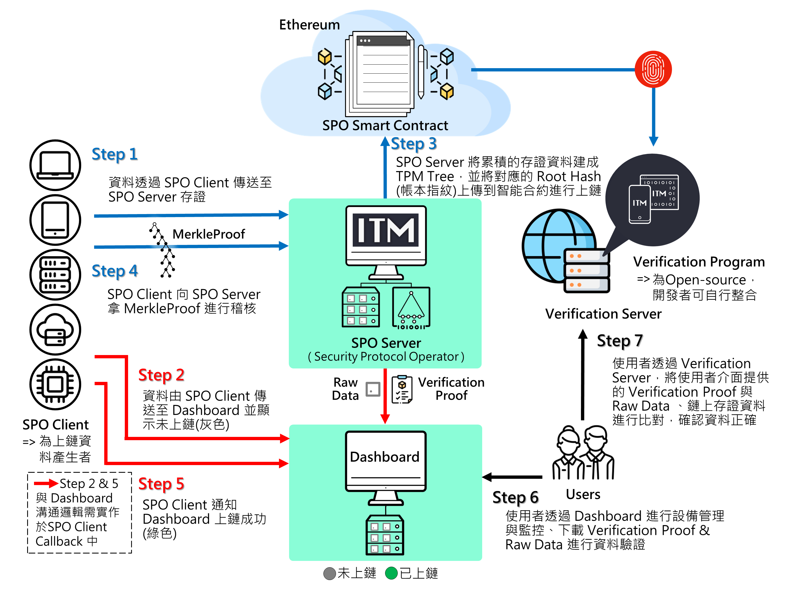

# ITM SPO SDK Sample 使用手冊

## Release Note

- [ITM SPO SDK Release Note](./doc/ReleaseNote.md)

## SPO Server 系統架構圖(含 Dashboard 公版)

## 架構元件說明

### SPO Client

1. 提供 SPO Client 為 Raw Data 進行清算上鏈的功能：產生 LedgerInput 並傳送至 SPO Server，並儲存 SPO Server 回傳的 Receipt
2. 當 SPO Server 通知已上鏈的 Clearance Order，會將對應的 Receipt 與智能合約上的 Clearance Record 進行驗證並產生驗證結果

### SPO Server

1. 接收 SPO Client 的 LedgerInput 並回傳 Receipt
2. 累積 LedgerInput 到所設定可上鏈的量再進行清算上鏈，上鏈成功會通知 SPO Client 進行驗證
3. 根據 Index Value Key 與時間區間進行搜尋，產生 VerificationProof，後續供公開的 [Verification Server](https://verification.itrustmachines.com/) 或自行整合的 [Verification Program](https://github.com/itrustmachines/spo-verification-program) 進行驗證

### Dashboard

裝置資料公版，提供以下內容：
1. 顯示 SPO Client 提供的 Raw Data
2. 顯示 Raw Data 的稽核狀態與 Etherscan (以太坊區塊鏈瀏覽器) 連結
3. 取得證據：使用者可在介面中，根據 Index Value Key 與時間區間進行搜尋，Dashboard 會向 SPO Server 索取並產生 VerificationProof

- 若開發者想要在 ITM 公版 Dashboard 上呈現上鏈資料，則 CMD 中必須包含 `deviceId` 與 `timestamp` 兩欄位

### Verification Server

- 本服務提供給無整合 [Verification Program](https://github.com/itrustmachines/spo-verification-program) 的使用者的公開線上驗證服務，其包含：證據驗證 (Proof Verification)、原始檔案驗證 (Raw Data Verification)、還原公鑰及位址 (Recovery Key and Address)
- Verification Server URL : https://verification.itrustmachines.com/

- 若開發者想要在 ITM 提供的公開驗證服務 [Verification Server](https://verification.itrustmachines.com/) 中使用原始檔案驗證功能，則 CMD 中必須增加 `fileName` 與 `fileHash` 兩欄位

### [Verification Program](https://github.com/itrustmachines/spo-verification-program)

1. 驗證 VerificationProof，並取得 Error Report 與 Raw Data

## SDK 列表
欲申請以下列表測試開發請[聯絡我們](https://itrustmachines.com/)
- [itm-mcu-porting-kit](https://github.com/itrustmachines/itm-mcu-porting-kit)
    - 提供 Linux C 或 Azure Sphere 的 SPO Client 範例程式碼
    - master branches 環境需求：Ubuntu 18.04 或 Centos 7 以上
    - azs-spo-c-client & azs-spo-c-client-single-thread branches 環境需求：
        - Azure Sphere SDK
        - Visual Studio 或 Visual Studio Code 開發環境
        - Windows 10 作業系統
- [itm-spo-sdk-java](https://github.com/itrustmachines/itm-spo-sdk-java)
    - 提供 Java 環境的 SPO Client 範例程式碼
    - 環境需求：Java 版本 8 以上，需安裝 Maven
- [itm-spo-sdk-android](https://github.com/itrustmachines/itm-spo-sdk-android)
    - 提供 Andriod 環境的 SPO Client 範例程式碼
    - 環境需求：
        - Java 版本 8 以上，需安裝 Maven
        - Android Studio 開發環境
- [itm-dashboard](https://github.com/itrustmachines/itm-dashboard)
    - 提供公版 Dashboard 範例程式碼
    - 環境需求：Java 版本 11 以上，需安裝 Maven
